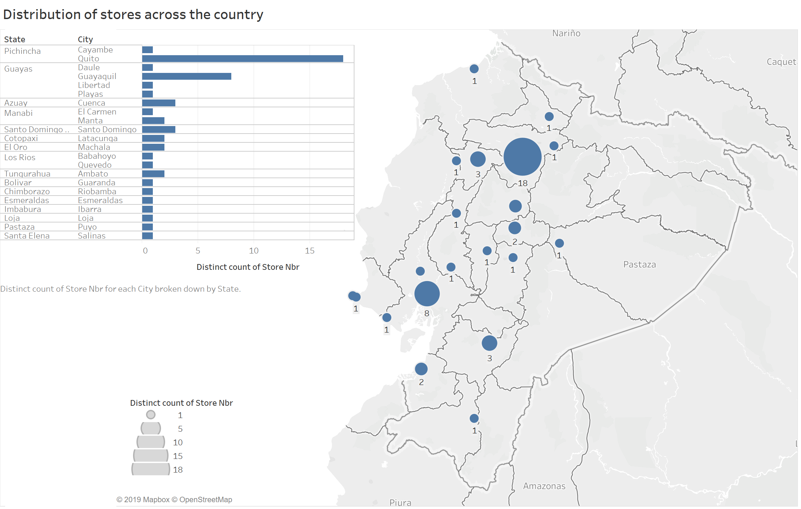
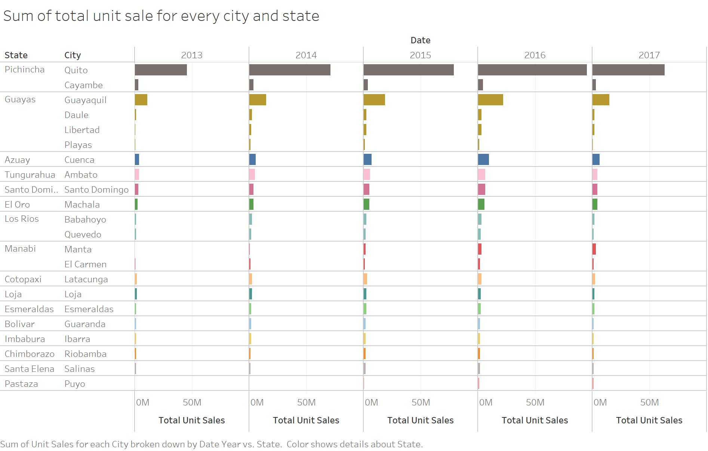
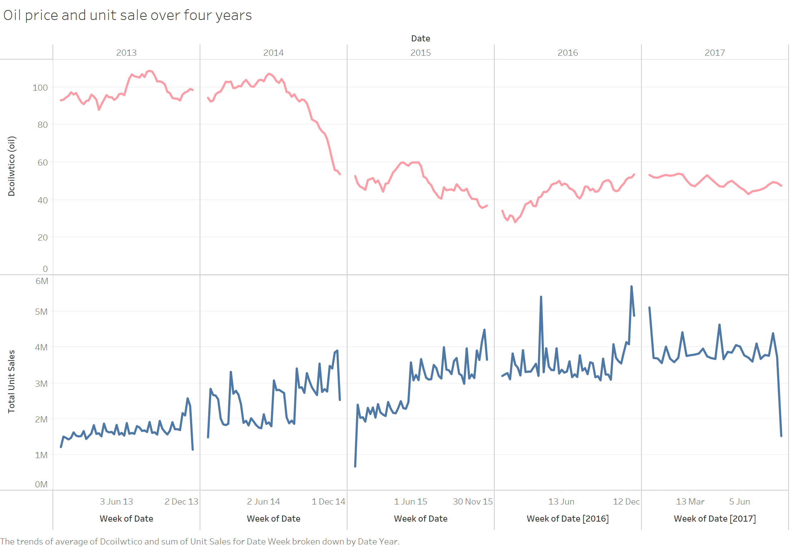
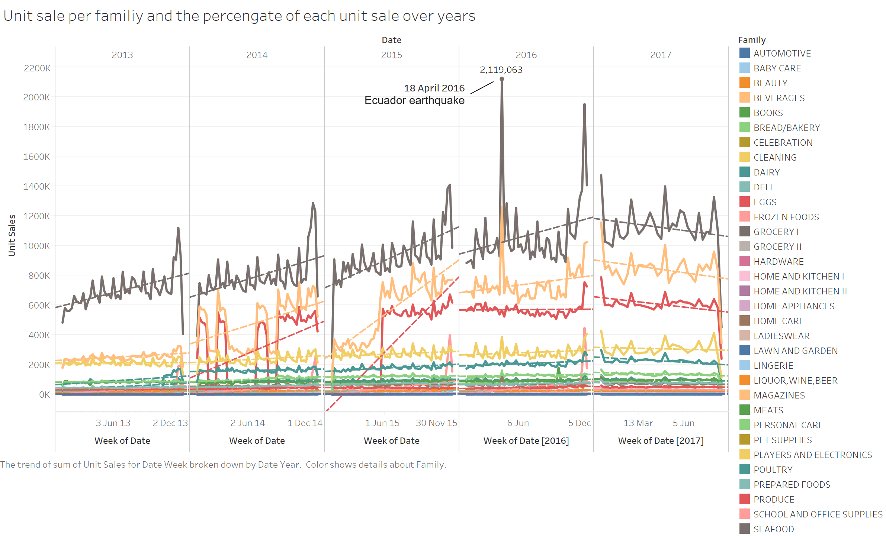
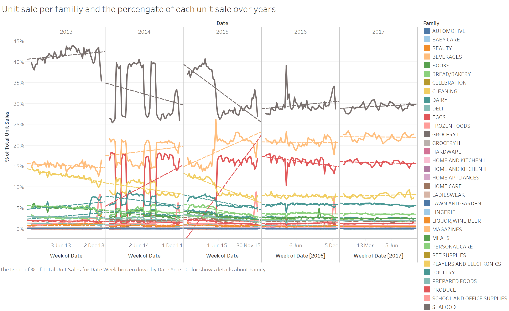
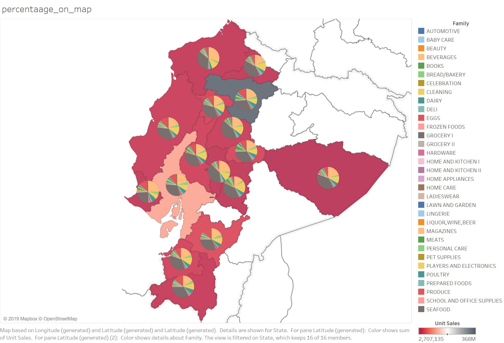
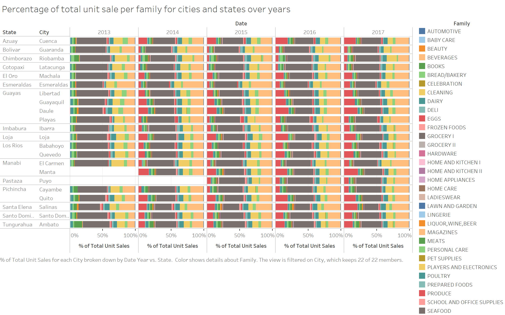
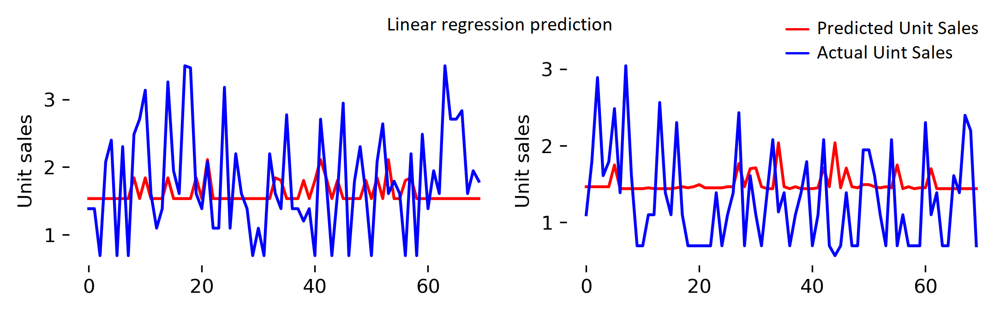

# Unit sales prediction 

The aim is to predict the unit sales for different items sold at different stores over a time period. The main data was provided in a Kaggle competition [Corporación Favorita Grocery Sales Forecasting](https://www.kaggle.com/c/favorita-grocery-sales-forecasting/data) 

The training data includes dates, store and item information, whether that item was being promoted, as well as the unit sales. Additional files include supplementary information that may be useful in building your models (see [here](https://www.kaggle.com/c/favorita-grocery-sales-forecasting/data) for more information).

- **Data overview**: providing a summary of the data
- **Data visualization**: providing some data visualization before jumping to modelling and prediction
- **Data prediction**: using different methods for unit sale prediction

## Data overview  
In total, the data includes:

|# stores | # states | # cities |# unique items | # item families  | # classes |
|---------|----------|----------|---------------|------------------|-----------|
|54       | 16       |22        | 4100          | 33               | 337       |

The test data have 60 unique items that are not included in the training data. Note that the following analysis was done based on training data just to validate the predictions (i.e., dividing train data to train and validation). To get this summary simply run this code: [`xx.py`](). Note that you need to change the paths and download and unzip the data into paths. Also, as the data is big it might take some time to run the code depending on the computer in use. 

## Data visualization
Let's first visualize the data. This helps us to get an idea about the sales, how stores are distributed, how sales (e.g., item families) are distributed geographically, and how they change over time (e.g., do sales have seasonal dependency, or do holidays affect them and how these are reflected on the type of the items/geographical regions, and etc). I used [Tableau Software](https://www.tableau.com) as it's a nice and quick way of visualization without any coding and loading hassles. Finally, everything can be saved in a Tableau package and used by any user. However, as the data was big the corresponding Tableau package was also big, bigger than the Github upload limit. So, I only include screen shuts here.

The map visualization shows that Favorita has stores in many states (not all though) and the state of Pichincha has significantly higher number of stores (19, in which 18 of them are located in the capital, Quito) than others.

The total unit sales are also significantly higher in Pichincha than other states:

I also aggregated the total weekly unit sales and visualized across the years to see if there is a pattern/trend in the sale data. Overall, it can be seen that the total weekly unit sales increases during the last few weeks of the year which end in the Christmas holidays. The overall sales across the years also follow season-dependent pattern with an upward trend toward the end of the year. There is also a large decrease in sales during mid-2015, which can be associated with the volcanic eruption in Aug 2015 in the state of Pichincha. Also, the sharp, spiky increase in sales on ~18 April 2016 might be associated with the earthquake on 16 April 2016.

Grouping the unit sales by their families shows that Grocery 1  has the highest unit sales followed by Beverages and Produce, and this trend is kept during the whole year. The unit sales trend for items from other families do not fluctuate a lot during the year and have a lower seasonal dependency.

Moreover, the small, but highly periodic, fluctuations across the year is aligned with the end of every month, meaning the total unit sales and unit sales for every family of items increases at the end of each month. This might be associated with people's salary payment (i.e., the unit sales increases as people have money to spend). This periodic pattern can be an important property of these time series that can help the prediction. 

Another question is how the percentage of unit sales per family changes over the weeks. This is important from the business perspective as it helps the business to predict if the demand for a particular item/family is going to be high at a certain period/time of the year. I calculated this for every family by dividing the unit sales of every family to total unit sales and plot it during the years.

The figure above shows that the Grocery I has the highest percentage amongst others. Also, the percentages for most families do not change a lot across the year (apart from some time periods due to some national events, for example, Aug and March 2014), suggesting that although the total unit sales increase across the year, people buy more items from each family (so the ratio doesn't actually change and people just buy more).

In the last visualization, I looked at the geographical dependency of unit sales. This can also be important from the business perspective as the climate and even the seasons are highly dependent on the geographical locations of cities and this can significantly affect the demand for particular products/families in a particular location.   

The figures below show the percentage of unit sales for every family relative to the overall unit sales. The results show that the *geographical dependency* is pretty low for all families. This is not surprising as Ecuador is a rather small country and the climate or season factor do not affect the sales that much. This can be quite different for a large country like Australia where there can be four different seasons in different locations of the country in a certain period of the year. 

## Data prediction 
### Data preparation
The first stage is to make a single, clean training and test data by filling the missing values and merging different tables (items, stores, holidays, etc.). The are many missing values in different columns. In most cases, I filled the missing values with the mean/median in a time window. Then, I divided the training data to 1) train and 2) validation sets. I tested the models using validation data as the test data do not have unit sales so I won't have any reference to check if the prediction method is actually working (but I predicted unit sales for the test data as well, but no true value to compare anyways). The Data preparation is done using this code ['xxpy'](codes/xx.py).

### Prediction methods
After data preparation, I used 1) Linear Regression and 2) Random Forest Regression to predict the unit sales. To do that, I train the model using a time window of historical data and predicted the future two-week unit sales (model test/validation). I selected a two-week time window to be able to run in my machine. After the first training phase, I selected the best feature sets (using [feature importance](https://scikit-learn.org/stable/modules/generated/sklearn.ensemble.RandomForestClassifier.html#sklearn.ensemble.RandomForestClassifier.feature_importances_)  and [ranking](https://scikit-learn.org/stable/modules/generated/sklearn.feature_selection.RFE.html)) and then train and predicted the unit sales based on selected features. The performance metrics are `rsquared` and `nwrmsle`.

Figures below show sample predictions for linear regression and random forest (the red trend is the prediction while the blue is true values. The vertical axis shows unit sales and the horizontal axis refers to items specific dates. I forgot to put labels and legends :()

It can be seen that linear regression does a poor prediction while the random forest is reasonably good in predicting the unit sales. Note that the results of the random forest can even improve by training on more dates. The linear regression here performs like a moving average over dates, so it easily fails to predict (large) fluctuations. 
  

